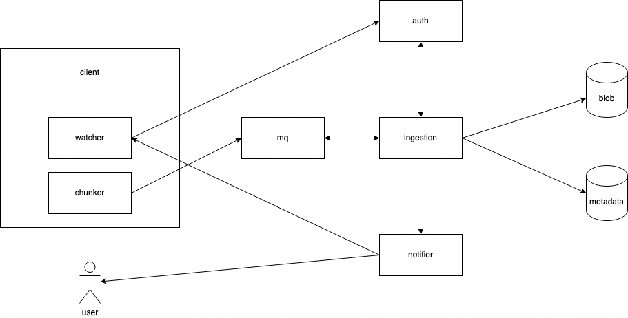

# mini-drive

A file upload service that manages low level Blob storage while providing users with an intuitive interface.

This project was inspired by my need to upload and archive gigabytes of GoPro footage on a daily basis.

## Requirements

Functional Requirements

- Handles upload and storage of video files

- Provides a UI to view uploaded files

- Able to process ~50gb of video footage within 5 mins

- Notifies users when upload is complete / fails, system is low on storage

Non-Functional Requirements

- Fault tolerant to interrupted uploads

Stretch Requirements

- Pushes upload changes to clients

## Design

### client - watcher

The watcher monitors for sync actions by the user (upload, view file). It notifies the chunker if a file is uploaded.

Specific to this project, I am implementing a watcher that detect connections with my GoPro / SD card. It will automatically trigger a watch action to begin the upload process for videos on the storage card.

### client - chunker

The chunker breaks the files into multiple small pieces and sends it to the mq. It creates a unique id / hash for each chunk so that downstream services are able to distinguish chunks from each other.

### mq

The mq handles async communication between the client and ingestion services. It decouples the time complexity between the client and ingestion, allowing a free ingestion worker to pick up the next chunk to be processed.

It has 1 queue for now: chunks to be processed by the ingestion service.

### ingestion

The ingestion service subscribes to upload messages on the mq, stores the chunk in the blob storage, generates and stores metadata corresponding to each blob.

### notifier

The notifier service is a telegram server that notifies me of upload events such as completed uploads, failed uploads and low disk memory.

### auth

Auth is a simple jwt authentication service that verifies if a given client is allowed to upload or read files.

### blob

Blob handles binary object storage and a posix system.

### metadata

The metadata db stores information pertaining to the chunk names, updated date and parent file name.

